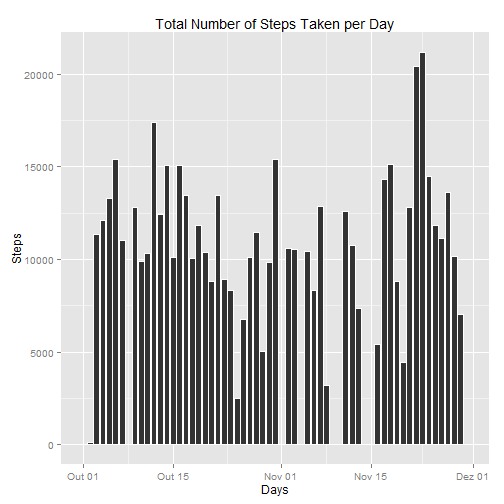
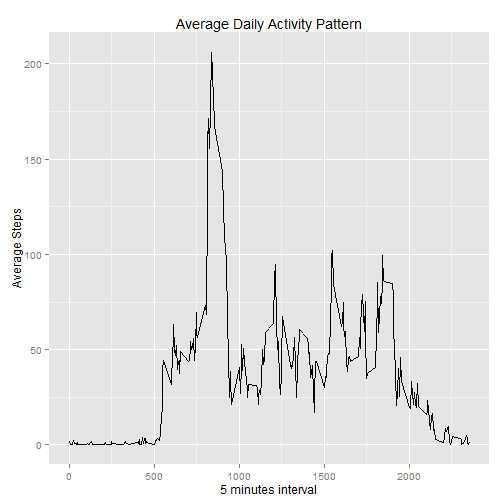
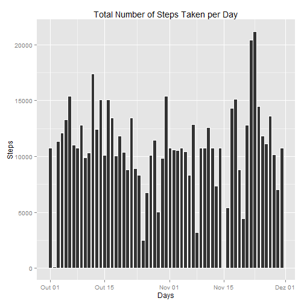
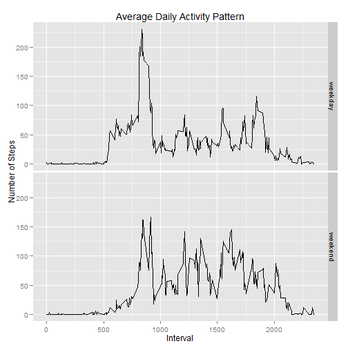

Peer Assessment 1 - Activity Monitoring Data
========================================================

## Introduction

It is now possible to collect a large amount of data about personal movement using activity monitoring devices such as a Fitbit, Nike Fuelband, or Jawbone Up. These type of devices are part of the “quantified self” movement – a group of enthusiasts who take measurements about themselves regularly to improve their health, to find patterns in their behavior, or because they are tech geeks. But these data remain under-utilized both because the raw data are hard to obtain and there is a lack of statistical methods and software for processing and interpreting the data.

This assignment makes use of data from a personal activity monitoring device. This device collects data at 5 minute intervals through out the day. The data consists of two months of data from an anonymous individual collected during the months of October and November, 2012 and include the number of steps taken in 5 minute intervals each day.

## Loading and preprocessing the data

First of all we need to load the data and process them to a more suitable format.

```r
temp <- tempfile()
download.file("http://d396qusza40orc.cloudfront.net/repdata%2Fdata%2Factivity.zip", temp)
data <- read.csv(unz(temp, "activity.csv"), header=T, colClasses=c("numeric", "Date", "numeric"), na.strings="NA")
unlink(temp)
```

Now that we have load the data we are ready to answer the questions.


## What is mean total number of steps taken per day?
========================================================

First you need to clean the data so it's easy to draw the histogram.

```r
steps <- c()
for(i in unique(data$date)){
        steps <- c(steps, sum(data[data$date == i, 1], na.rm=T))
}
cleanData <- data.frame(unique(data$date), steps)
```

Now you are ready to draw the histogram with ggplot2.

```r
library(ggplot2)
ggplot(cleanData, aes(unique.data.date., steps)) + geom_histogram(stat="identity", colour="white") + ggtitle("Total Number of Steps Taken per Day") + xlab("Days") + ylab("Steps")
```

 

The mean of steps taken by day is 9354.2295 and the median is 1.0395 &times; 10<sup>4</sup>.


## What is the average daily activity pattern?
========================================================

Again, you need to clean the data so it's easy to plot the time series.

```r
stepsAvg <- c()
for(i in unique(data$interval)){
        stepsAvg <- c(stepsAvg, mean(data[data$interval == i, 1], na.rm=T))
}
cleanData <- data.frame(unique(data$interval), stepsAvg)
```

Now you are ready to draw the time series plot with ggplot2.

```r
ggplot(cleanData, aes(unique.data.interval., stepsAvg)) + geom_line() + ggtitle("Average Daily Activity Pattern") + xlab("5 minutes interval") + ylab("Average Steps")
```

 

The maximum number of steps occurs on 835th interval.


## Imputing missing values
========================================================

The dataset has 2304 missing values.  
Now we are going to copy the data to a new dataset and replace the NA values with the mean of it's 5 minute interval.

```r
newData <- data
for(i in row.names(newData[!complete.cases(newData),])){
        newData[as.numeric(i),1] = cleanData[cleanData[,1] == newData[as.numeric(i), 3] ,2]
}
```

First you need to clean the data so it's easy to draw the histogram.

```r
steps <- c()
for(i in unique(newData$date)){
        steps <- c(steps, sum(newData[newData$date == i, 1], na.rm=T))
}
cleanData <- data.frame(unique(newData$date), steps)
```

Now you are ready to draw the histogram with ggplot2.

```r
ggplot(cleanData, aes(unique.newData.date., steps)) + geom_histogram(stat="identity", colour="white") + ggtitle("Total Number of Steps Taken per Day") + xlab("Days") + ylab("Steps")
```

 

The mean of steps taken by day is 1.0766 &times; 10<sup>4</sup> and the median is 1.0766 &times; 10<sup>4</sup>.  
As we can see with the cleaning of the NA values the histogram has less lacks of data and it's more accurate. Also the mean value closer to the median.


## Are there differences in activity patterns between weekdays and weekends?
========================================================

First we need to create a new column with a factor so we can easily split the dates between weekday and weekend.

```r
factor <- c()
for(i in as.character(newData[,2])){
        if(weekdays(as.Date(i), abbreviate=T) == "dom" | weekdays(as.Date(i), abbreviate=T) == "sáb"){
                factor <- c(factor, "weekend")
        } else {
                factor <- c(factor, "weekday")
        }
}
factorData <- data.frame(newData, factor(factor))
```

Now we have to clean the data to plot the time series.

```r
stepsAvg <- c()
factor <- c()
interval <- c()
for(i in levels(factorData$factor.factor.)){
        for(j in unique(factorData[factorData$factor.factor.==i,3])){
                stepsAvg <- c(stepsAvg, mean(factorData[factorData$factor.factor. == i & factorData$interval == j, 1], na.rm=T))
                factor <- c(factor, i)
                interval <- c(interval, j)
        }
}
cleanData <- data.frame(interval, stepsAvg, factor)
```

And now we can plot the time series for each factor to easily compare between both.

```r
ggplot(cleanData, aes(interval, stepsAvg)) + geom_line() + facet_grid(factor~.) + ggtitle("Average Daily Activity Pattern") + xlab("Interval") + ylab("Number of Steps")
```

 


